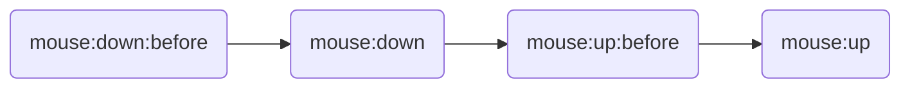
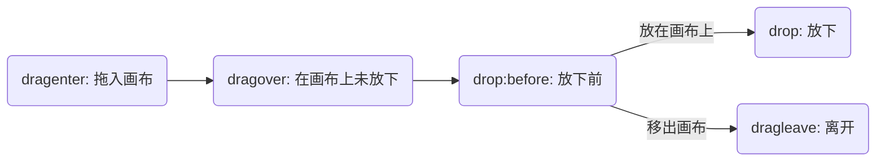
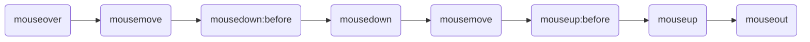

# {{ $frontmatter.title }}

<script setup>
import EventPlayground from './demos/Event.vue'
</script>

## 事件的使用方式

所有继承于 `fabric.Object` 的对象(实质上是继承于 `Observable` )均支持使用 `on`, `once`, `off` 进行事件的绑定与解绑,
也可使用 `fire` 来触发自定义监听事件.

### on - 绑定事件

+ `on(事件名称, 处理函数)`
+ `on(事件名称与处理函数的键值对)`

### once- 只触发一次的绑定事件

+ `once(事件名称, 处理函数)`
+ `once(事件名称与处理函数的键值对)`

### off - 解绑事件

+ `off(事件名称, 绑定的处理函数)`: 解绑对象指定的事件
+ `off(事件名称)`: 解绑对象指定类型的**全部**事件
+ `off()`: 解绑对象**全部**事件

### fire - 触发事件

该方法主要用于搭配 `on` 或 `once` 来触发**非**fabric提供的事件(自定义事件)

+ `fire(事件名称, 可选参数)`: 调用对应事件的绑定函数并传入可选参数

## 画布事件

画布事件主要用来监听整个画布内元素的变动、选中以及更新，还可以用来监听鼠标的各类事件。

### 渲染相关

| 事件名称 | 描述 |
| ------ | -- |
| `canvas:cleared` | 画布清除后 |
| `before:render` | 渲染前 |
| `after:render` | 渲染后 |

### 对象监听

| 事件名称 | 描述 |
| ------ | -- |
| `objcet:modified` | 对象被修改 |
| `objcet:moving` | 对象移动中 |
| `objcet:scaling` | 对象缩放中 |
| `objcet:rotating` | 对象旋转中 |
| `objcet:skewing` | 对象倾斜中 |
| `objcet:resizing` | 对象改变大小中 |
| `objcet:added` | 对象被添加到画布 |
| `objcet:removed` | 对象从画布中移除 |
| `before:transform` | 开始变换之前 |

### 选区相关

::: tip 提示
对象的选中也算selection
:::

| 事件名称 | 描述 |
| ------ | -- |
| `before:selection:cleared` | 清除选中之前 |
| `selection:cleared` | 清除选中后 |
| `selection:created` | 创建选中后 |
| `selection:updated` | 更新选中后(切换选中对象) |

### 鼠标事件

| 事件名称 | 描述 |
| ------ | -- |
| `mouse:up` | 鼠标按键抬起 |
| `mouse:up:before` | 鼠标按键抬起之前 |
| `mouse:down` | 鼠标按键按下 |
| `mouse:down:before` | 鼠标按键按下之前 |
| `mouse:move` | 鼠标移动 |
| `mouse:move:before` | 鼠标移动之前 |
| `mouse:dblclick` | 鼠标双击 |
| `mouse:wheel` | 鼠标滚轮 |
| `mouse:over` | 鼠标移入画布 |
| `mouse:out` | 鼠标移出画布 |

鼠标在画布中单击所触发的事件顺序



所以我们如果要监听点击事件, 可以使用 `mouse:up` 或者特定元素的 `mouseup` 事件.(如果想要鼠标按下就触发就用`down`)

### 拖放事件
DnD, Drop and Drag, 将元素拖到画布中以及放下的事件.

可用于类似于流程图的元素拖动到画布中触发的事件.

将一个 `draggable` 元素拖到画布并放下所触发的事件顺序如下:



:::tip 提示
`dragover` 事件会在鼠标未放开(拖拽元素放下)之前持续触发
:::

| 事件名称 | 描述 |
| ------ | -- |
| `drop:before` | 放置元素前  |
| `drop` | 放置元素 |
| `dragover` | 拖动(在画布中) |
| `dragenter` | 拖入画布 |
| `dragleave` | 拖离画布 |

#### 键盘事件

fabric 未提供key相关事件, 需要我们自行为canvas元素绑定key相关事件, 比如为 `Canvas` 绑定 `keydown` 事件

```ts
const el = canvas.wrapperEl
el.setAttribute('tabindex', '1')
el.style.outline = 'none'
el.addEventListener('keydown', e => {
  console.log('keydown', e)
})
```

## 对象事件

### 变换

| 事件名称 | 描述 |
| ------ | -- |
| `moving` | 移动中 |
| `scaling` | 缩放中 |
| `rotating` | 旋转中 |
| `skewing` | 倾斜中 |
| `resizing` | 改变大小 |

其中 `resizing` 只针对于 `Textbox` 对象的宽度调整(左侧及右侧的控制点, 其余控制点操作仍然为 `scaling` )

### 鼠标事件

| 事件名称 | 描述 |
| ------ | -- |
| `mouseup` | 鼠标按键抬起 |
| `mousedown` | 鼠标按键按下 |
| `mousemove` | 鼠标在元素上移动 |
| `mouseup:before` | 鼠标按键抬起之前 |
| `mousedown:before` | 鼠标按键按下之前 |
| `mousemove:before` | 鼠标移动之前 |
| `mousedblclick` | 双击鼠标 |
| `mousewheel` | 鼠标滚轮 |
| `mouseover` | 鼠标移入元素 |
| `mouseout` | 鼠标移出元素 |

在画布中拖动元素所触发的事件顺序如下:



### 拖放事件

用于监听画布外**可拖动**元素拖到画布内元素上所触发的事件， 触发顺序与[画布拖放事件](#拖放事件)相同

| 事件名称 | 描述 |
| ------ | -- |
| `drop:before` | 放置元素前  |
| `drop` | 放置元素 |
| `dragover` | 拖动(在画布元素中) |
| `dragenter` | 拖入 |
| `dragleave` | 拖离 |

### 其他事件

除了上面列表列出的事件外, fabric 对象还隐式提供了 `onSelect` 与 `onDeselect` 方法供我们覆写来实现对象的 `选中` 及 `取消选中` 的监听.

这两个方法如果返回 `true`, 则会中断后续操作(不会被选中/不会被取消选中)

## 自定义事件

同时, fabric 也支持使用 `on/once` 方法来绑定自定义事件, 搭配 `fire` 进行使用.

```ts
const rect = new fabric.Rect({
  width: 50,
  height: 40,
})

rect.on('click', e => {
  console.log(e)
})

const button = document.querySelector('#btn')
button.addEventListener('click', () => {
  rect.fire('click', { msg: 'wooooo!' })
})
```

想要详细了解源码写法可以前往[源码分析/Observable](/mixins/observable.md)进行查看.

:::details Demo: 分别为矩形和画布绑定事件

```ts
// 以 矩形-Rect 为例
const c = new fabric.Canvas('#c')
const rect = new fabric.Rect({ width: 20, height: 20 })

rect.on('moving', e => {
  console.log(e)
})

c.add(rect)
c.on('object:added', e => {
  console.log(e)
})

```
:::

## Playground

> 也可以前往官方提供的[Demo地址](http://fabricjs.com/events)进行尝试

<EventPlayground></EventPlayground>
