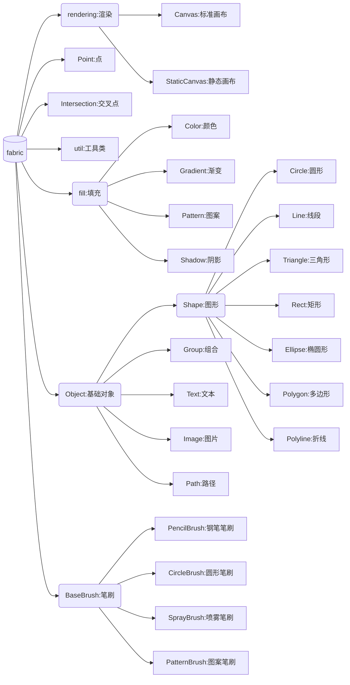

# Fabric 对象一览

```mermaid
graph LR
fb[(fabric)]
fb --> obj(Object:基础对象)
fb --> Point:点
fb --> Intersection:交叉点
fb --> util:工具类
fb --> brush(BaseBrush:笔刷)
fb --> r(rendering:渲染)
fb --> f(fill:填充)

r --> Canvas:标准画布
r --> StaticCanvas:静态画布

f --> Color:颜色
f --> Gradient:渐变
f --> Pattern:图案
f --> Shadow:阴影

obj --> Shape(Shape:图形)

Shape --> Circle:圆形
Shape --> Line:线段
Shape --> Triangle:三角形
Shape --> Rect:矩形
Shape --> Ellipse:椭圆形
Shape --> Polygon:多边形
Shape --> Polyline:折线

obj --> Group:组合
obj --> Text:文本
obj --> Image:图片
obj --> Path:路径

brush --> PencilBrush:钢笔笔刷
brush --> CircleBrush:圆形笔刷
brush --> SprayBrush:喷雾笔刷
brush --> PatternBrush:图案笔刷
```
