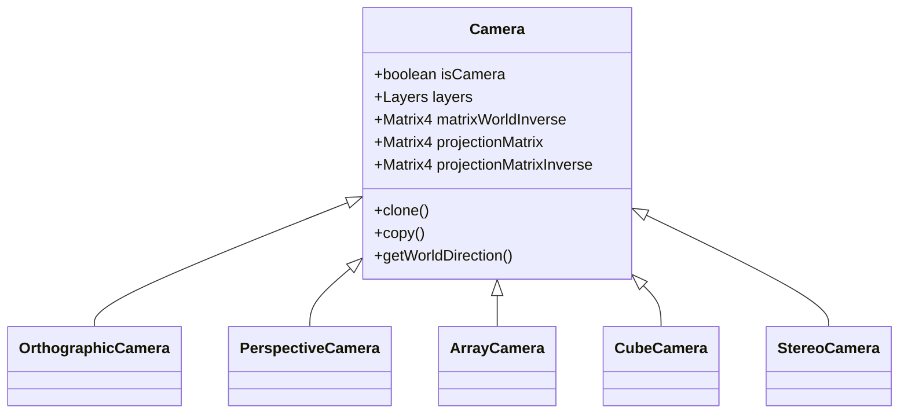

# Camera

相机分为以下几类:

+ **OrthographicCamera(透视相机)**
+ **PerspectiveCamera(正交相机)**
+ ArrayCamera(相机阵列)
+ CubeCamera(立方相机)
+ StereoCamera(立体相机)

```mermaid
classDiagram
  
  Camera <|-- OrthographicCamera
  Camera <|-- PerspectiveCamera
  Camera <|-- ArrayCamera
  Camera <|-- CubeCamera
  Camera <|-- StereoCamera
  
  Camera : +boolean isCamera
  Camera : +Layers layers
  Camera : +Matrix4 matrixWorldInverse
  Camera : +Matrix4 projectionMatrix
  Camera : +Matrix4 projectionMatrixInverse
  
  Camera : +clone()
  Camera : +copy()
  Camera : +getWorldDirection()
  
  class OrthographicCamera{
    
  }
  class PerspectiveCamera{
    
  }
  class ArrayCamera{
    
  }
  class CubeCamera{
    
  }
  class StereoCamera{
  }
```
