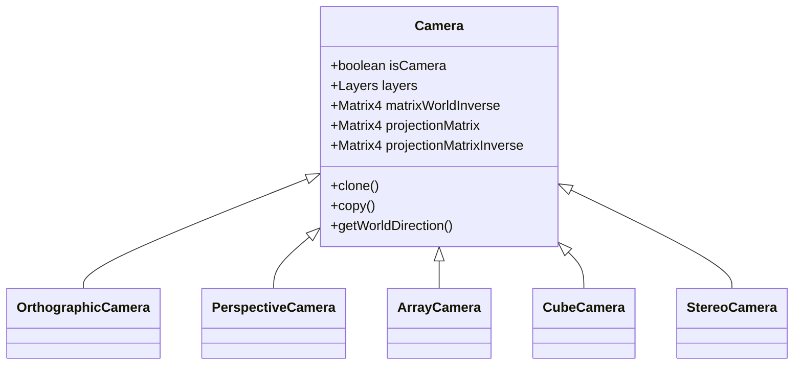

# Camera

同现实中的相机一样, Three.js 的相机也是用来拍摄并显示被摄物体的

## 分类

相机分为以下几类:

+ **[OrthographicCamera](orthographic_camera)(正交相机, 2D相机)**
+ **[PerspectiveCamera](perspective_camera)(透视相机, 3D相机)**
+ [ArrayCamera](array_camera)(相机阵列, 一堆相机)
+ [CubeCamera](cube_camera)(立方相机)
+ [StereoCamera](stereo_camera)(立体相机, VR相机)

## 属性

| 属性                      | 类型      | 说明                        |
|-------------------------|---------|---------------------------|  
| id                      | String  | 对象的唯一编号,默认为空字符串           |
| uuid                    | String  | 对象的 uuid,默认值为一个随机生成的 uuid | 
| name                    | String  | 对象的名称,默认为空字符串             |
| type                    | String  | 对象的类型,默认为 'Camera'        |
| matrixWorldInverse      | Matrix4 | 相机在世界空间中的逆矩阵              |
| projectionMatrix        | Matrix4 | 相机的投影矩阵                   |
| projectionMatrixInverse | Matrix4 | 相机投影矩阵的逆矩阵                |

## 方法

| 方法                       | 说明             |
|--------------------------|----------------|
| clone()                  | 克隆相机对象         |
| copy()                   | 复制相机对象到另一个相机对象 |  
| getWorldDirection()      | 获取相机在世界空间中的方向  |
| updateMatrixWorld()      | 更新相机的世界矩阵      |
| updateProjectionMatrix() | 更新相机的投影矩阵      |
| setViewOffset()          | 设置视口偏移量        |
| toJSON()                 | 转成 json 对象     |
| lookAt()                 | 相机朝向指定位置       |

## 总结

1. 相机的属性变更后需要调用 `updateProjectionMatrix()` 方法
