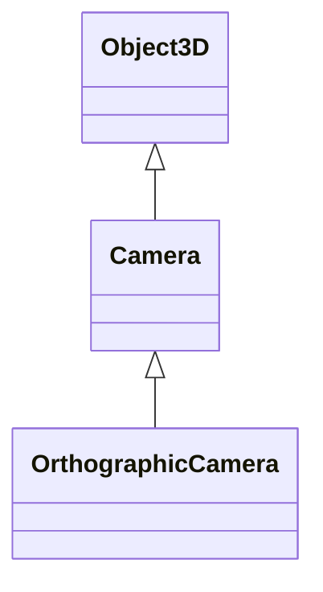

# 正交相机(OrthographicCamera)

> 官方介绍:
> 此相机使用正交投影创建2D视图。在与相机的距离变化中,物体的大小不会发生变化。

## 继承关系

## 构造函数

`OrthographicCamera( left, right, top, bottom, near, far )`

- `left`: 视锥体左边界
- `right`: 视锥体右边界
- `top`: 视锥体上边界
- `bottom`: 视锥体下边界
- `near`: 视锥体近端面
- `far`: 视锥体远端面

## 属性

与 Camera 类的共有属性相同,常用的特有属性:

- `.isOrthographicCamera`: 是否是正交相机对象
- `.zoom`: 获取或设置相机的缩放值

## 方法

### `.setViewOffset()`

设置视口偏移量

### `.updateProjectionMatrix()`

更新投影矩阵

### `.lookAt(x, y, z)`

设置相机方向

## 适用场景

适用于对透视效果无要求而更重视对象大小比例的场景,例如 2D 游戏、CAD 设计等。

## 参考资料

[OrthographicCamera 文档 ↗](https://threejs.org/docs/index.html#api/zh/cameras/OrthographicCamera)
