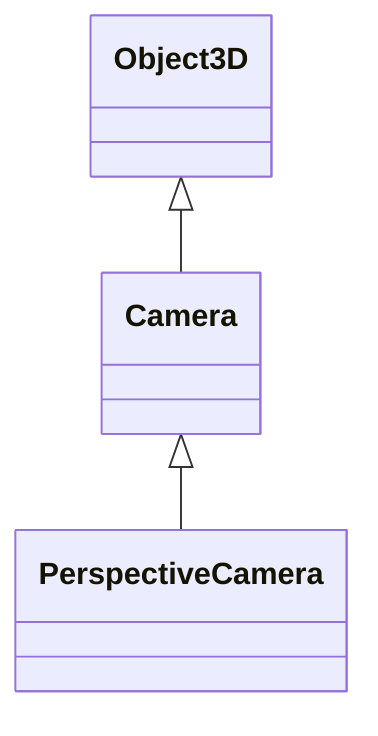

# 透视相机(PerspectiveCamera)

> 官方介绍:  
> 这一投影模式被用来模拟人眼所看到的景象，它是3D场景的渲染中使用得最普遍的投影模式。

## 继承关系



## 构造函数

`PerspectiveCamera( fov : Number, aspect : Number, near : Number, far : Number )`

+ `fov`: field of view, 垂直视场角大小(垂直视野大小), 默认 `50`
+ `aspect`: 画面长宽比
+ `near`: 相机的近端面距离, 默认 `0.1`, 取值范围为`[0, far]`
+ `far`: 相机的远端面距离, 默认 `2000`

### 参数解释

#### `fov`

Field Of View, 视场角, 决定了摄像机的视野范围

在现实中相机等的FOV主要指的是对角线, 而 Three.js 则指的是垂直方向的角度

在成像尺寸不变的情况下, fov越大则拍摄的物体(显示的)越小(因为视野广了, 但是成像尺寸没变, 所以物体就相对变小了)

#### `aspect`

成像画面的长宽比

#### `near`

可以理解为相机的最近可视距离, 比如 near 设置为 10, 那么距离相机小于 10 的物体将不会被渲染

#### `far`

相机显示物体的最远距离, 超出该距离的物体将不会被渲染

> 所以, 只有 near ~ far 之间的物体可以被渲染

### Demo
<script setup>
import FovDemo from './FovDemo.vue'
</script>

<FovDemo />


### 属性调整

除了 `Camera` 共有属性外, 透视相机还提供了以下属性来供开发者获取/设置属性

::: warning 注意
修改属性后需要调用 [updateProjectionMatrix](https://threejs.org/docs/index.html#api/zh/cameras/PerspectiveCamera.updateProjectionMatrix) 方法来使属性变更生效
:::

| 属性                   | 类型      | 描述                       |
|:---------------------|:--------|:-------------------------|
| .aspect              | Float   | 摄像机视锥体的长宽比               |     
| .far                 | Float   | 摄像机的远端面                  |
| .filmGauge           | Float   | 胶片尺寸                     |
| .filmOffset          | Float   | 水平偏离中心偏移量                |  
| .focus               | Float   | 用于立体视觉和景深效果的物体的距离        |
| .fov                 | Float   | 摄像机视锥体垂直视野角度             |
| .isPerspectiveCamera | Boolean | 对象是否为PerspectiveCamera对象 |  
| .near                | Float   | 摄像机的近端面                  |
| .view                | Object  | 视窗窗格或null                |
| .zoom                | number  | 摄像机的缩放倍数                 |

### 常用方法

#### lookat(x, y, z)

使摄像机将 `(x, y, z)` 点置于画面中心, 比如

+ 使摄像机看向原点
  ```js
  // camera 已预先定义
  camera.lookat(0, 0, 0)
  ```
+ 看向某个物体
  ```js
  camera.lookat(mesh.position)
  ```

#### 
