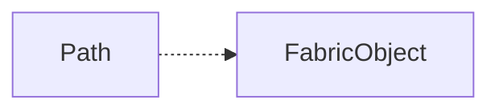

# {{ $frontmatter.title }} <Badge type="warning" text="wip"/>

Path 对象也继承于 FabricObject



## 构造函数 - constructor

```ts
export class Path extends FabricObject {
  // ...
  constructor(
    path: PathData | string,
    { path: _, left, top, ...options }: any = {}
  ) {
    super(options);

    const pathTL = this._setPath(path || []);
    const origin = this.translateToGivenOrigin(
      new Point(left ?? pathTL.x, top ?? pathTL.y),
      typeof left === 'number' ? this.originX : 'left',
      typeof top === 'number' ? this.originY : 'top',
      this.originX,
      this.originY
    );
    this.setPositionByOrigin(origin, this.originX, this.originY);
  }
}

```
