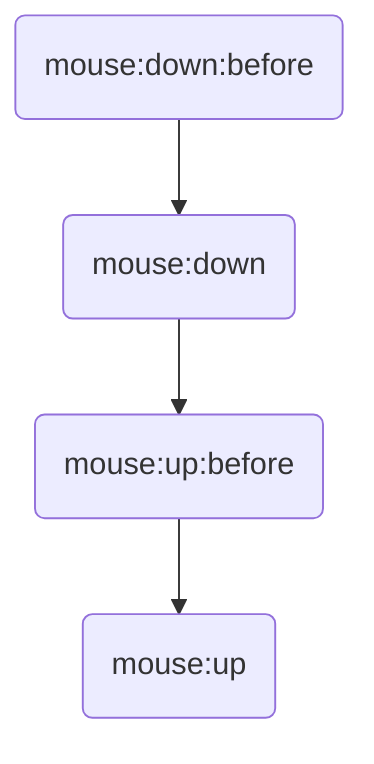
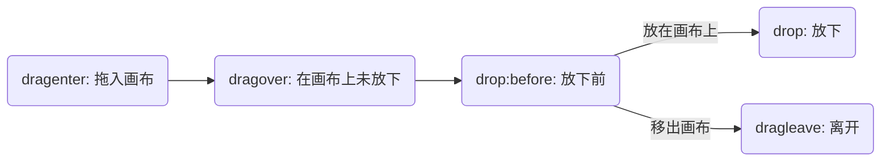

# {{ $frontmatter.title }} <Badge type="warning" text="WIP" />

<script setup>
import EventPlayground from './demos/Event.vue'
</script>

fabric 提供了画布对象事件以及对象事件, 为 fabric 对象绑定事件的语法为:

`fabricObject.on(eventType, handler)`

解绑事件的语法为:

`fabricObject.off(eventType, handler)`

可以使用 `fabricObject.off()` 解绑全部事件

:::details Demo: 分别为矩形和画布绑定事件

```typescript
// 以 矩形-Rect 为例
const c = new fabric.Canvas('#c')
const rect = new fabric.Rect({ width: 20, height: 20 })

rect.on('moving', e => {
  console.log(e)
})

c.add(rect)
c.on('object:added', e => {
  console.log(e)
})

```

:::

## Playground

> 也可以前往官方提供的[Demo地址](http://fabricjs.com/events)进行尝试

<ClientOnly>
<EventPlayground></EventPlayground>
</ClientOnly>

## 画布事件

画布事件主要用来监听整个画布内元素的变动、选中以及更新，还可以用来监听鼠标的各类事件。

### 对象监听

| 事件名称 | 描述 |
| ------ | -- |
| `objcet:modified` | 对象被修改 |
| `objcet:moving` | 对象移动中 |
| `objcet:scaling` | 对象缩放中 |
| `objcet:rotating` | 对象旋转中 |
| `objcet:skewing` | 对象倾斜中 |
| `objcet:resizing` | 对象改变大小中 |
| `objcet:added` | 对象被添加到画布 |
| `objcet:removed` | 对象从画布中移除 |
| `before:transform` | 开始变换之前 |

### 选区相关

| 事件名称 | 描述 |
| ------ | -- |
| `before:selection:cleared` | 清除选中之前 |
| `selection:cleared` | 清除选中后 |
| `selection:created` | 创建选中后 |
| `selection:updated` | 更新选中后(切换选中对象) |

### 鼠标事件

| 事件名称 | 描述 |
| ------ | -- |
| `mouse:up` | 鼠标按键抬起 |
| `mouse:up:before` | 鼠标按键抬起之前 |
| `mouse:down` | 鼠标按键按下 |
| `mouse:down:before` | 鼠标按键按下之前 |
| `mouse:move` | 鼠标移动 |
| `mouse:move:before` | 鼠标移动之前 |
| `mouse:dblclick` | 鼠标双击 |
| `mouse:wheel` | 鼠标滚轮 |
| `mouse:over` | 鼠标移入画布 |
| `mouse:out` | 鼠标移出画布 |

鼠标在画布中单击所触发的事件顺序



### 拖放事件
DnD, Drop and Drag, 将元素拖到画布中以及放下的事件.

可用于类似于流程图的元素拖动到画布中触发的事件.

将一个 `draggable` 元素拖到画布并放下所触发的事件顺序如下:



:::tip 提示
`dragover` 事件会在鼠标未放开之前持续触发
:::

| 事件名称 | 描述 |
| ------ | -- |
| `drop:before` | 放置元素前  |
| `drop` | 放置元素 |
| `dragover` | 拖动(在画布中) |
| `dragenter` | 拖入画布 |
| `dragleave` | 拖离画布 |

### 键盘事件

fabric 未提供key相关事件, 需要我们自行为canvas元素绑定key相关事件


## 对象事件

### 变换

| 事件名称 | 描述 |
| ------ | -- |
| `moving` | 移动中 |
| `scaling` | 缩放中 |
| `rotating` | 旋转中 |
| `skewing` | 倾斜中 |
| `resizing` | 改变大小 |


### 鼠标事件

| 事件名称 | 描述 |
| ------ | -- |
| `mouseup` | 鼠标按键抬起 |
| `mousedown` | 鼠标按键按下 |
| `mousemove` | 鼠标移动 |
| `mouseup:before` | 鼠标按键抬起之前 |
| `mousedown:before` | 鼠标按键按下之前 |
| `mousemove:before` | 鼠标移动之前 |
| `mousedblclick` | 双击鼠标 |
| `mousewheel` | 鼠标滚轮 |
| `mouseover` | 鼠标移入元素 |
| `mouseout` | 鼠标移出元素 |

### 拖放事件

用于监听画布外**可拖动**元素拖到画布内元素上所触发的事件， 触发顺序与[画布拖放事件](#拖放事件)相同

| 事件名称 | 描述 |
| ------ | -- |
| `drop:before` | 放置元素前  |
| `drop` | 放置元素 |
| `dragover` | 拖动(在画布元素中) |
| `dragenter` | 拖入 |
| `dragleave` | 拖离 |
