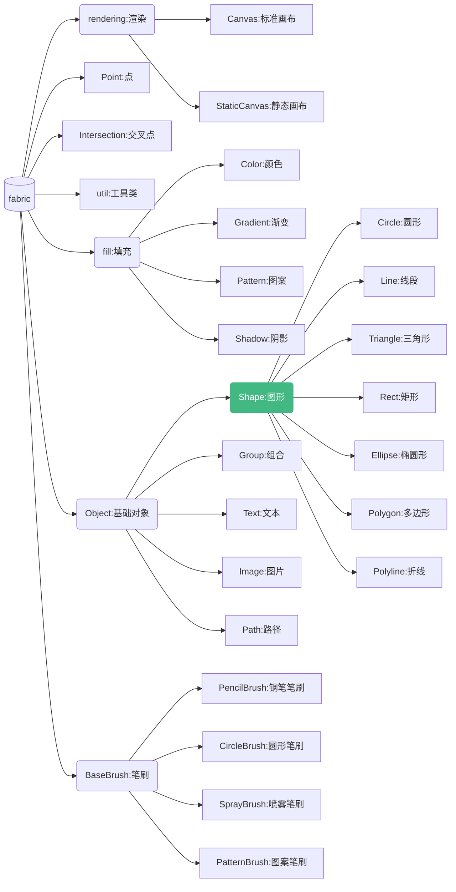

# 介绍

本文档基于 `fabric 5.x` 版本进行编写. 在写该文档的这段时间 fabric 开发者们也在积极地
将老旧代码更新到TypeScript写法(这个时间点有点尴尬,我一边写,它一边改), 不过整体的思路还是
不变的, 阅读本文档可以着重于思路而非具体代码实现.

fabric 同样也不支持 IE11及古老游览器

而且目前 Canvas 原生提供越来越多便利的 API 供我们更方便的绘制图形, fabric 6.x 也会逐步
跟进更新为这些 api. 这里是开发者的一些讨论: [GitHub | Leveraging new canvas api](https://github.com/fabricjs/fabric.js/issues/8387).

Canvas2D更新API可以前往该博客查看: [It's always been you, Canvas2D](https://developer.chrome.com/blog/canvas2d/)

## fabric 对象一览

